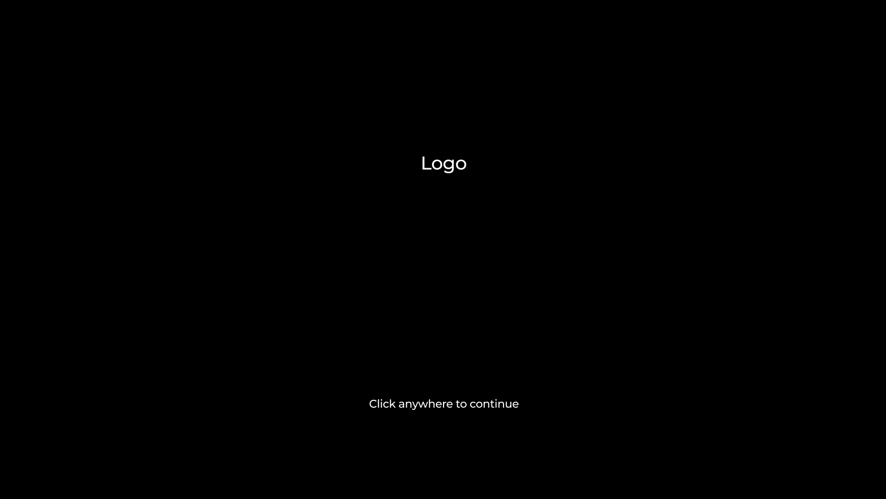
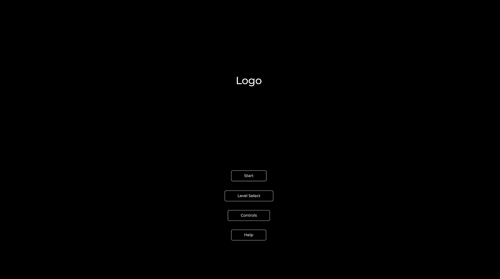
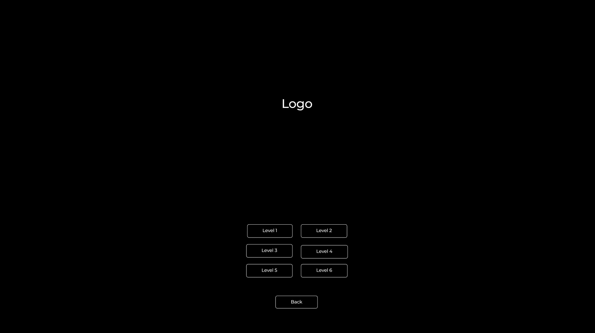
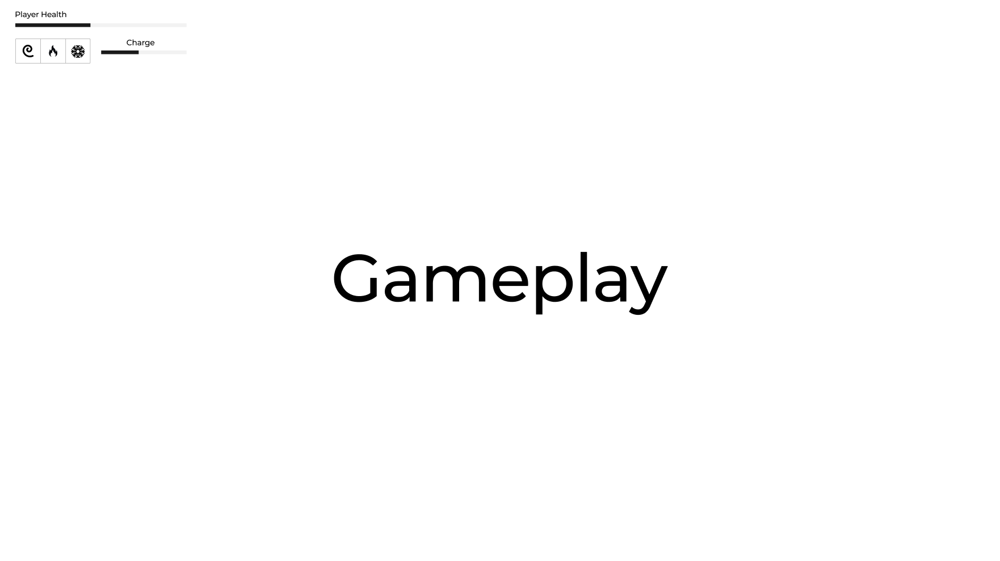

# Amphibious Arcana

by Facundo Lopez Camino, Andrew Guo, and Nick Guzzardo

## Introduction

This document describes a game called “FrogWizard’s Odyssey”. It is a 2D side scrolling, platformer game. The game will employ a variety of bosses which will allow the player to acquire new abilities for them to use in the remainder of their quest.

## Technology

FrogWizard’s Odyssey will be developed using the Wolfie 2D game engine. Music will be created using [Music/Audio program] and sound effects will be created from Chiptone. Sprites and other artworks will be created through piskel or taken from the existing Sprites page.

## Backstory

[Name] is a wizard. He lives in a village full of other wizards. One night, an evil wizard launches a surprise attack on his village. The evil wizard steals the power of all the wizards and turns them into frogs. [Name] is the only one that is strong enough to travel long distances after being turned into a frog. He vows to track down the evil wizard and take back the powers of the wizards in his village.

## Objective

[Name] journeys across the land searching for traces of the evil wizard. He comes across many powerful enemies that might’ve been the evil wizard’s minions. After defeating each powerful enemy, he regains one of the powers he has lost. Eventually, with some of his power back, he needs to defeat the evil wizard at the end and turn everyone back to normal.

## Gameplay

The game will be a side scroller with a mixture of vertical and horizontal platforming. There will also be boss fights at the end of every 2 levels.

[Name] has multiple abilities he can use to attack and move around:

-   Tongue swinging/grappling/attacking
-   Fireballs can be thrown at enemies or thrown underneath [Name] to propel him forward in the air
-   Ice Blast can be used to freeze enemies into blocks of ice [Name] can jump on, or for just stunning larger enemies

The game will have 6 levels.

-   Levels 1 & 2 will allow the player to get used to movement and combat using just the tongue ability. The boss fight at the end of level 2 will focus on close range combat. After killing this boss, the player will unlock the Fireball spell.
-   Levels 3 & 4 will now allow the player to use fireballs to attack enemies, as well as use the fireball explosions to propel them across the level during the platforming. The boss fight at the end of level 4 will focus on longer range combat. After killing this boss, the player will unlock the Ice Blast spell.
-   Levels 5 & 6 will now allow the player to shoot ice at enemies to freeze and stun them in place. Smaller enemies will turn into ice blocks which the player can jump on to aid in traversing the level. The boss fight at the end of level 6 combines everything the player has learned so far. After killing this boss, the game ends and the player has won.

## Controls

The game will be played with both a keyboard and a mouse. The mouse will be used for aiming, and the following keybinds will be used:

- **W** - Jump

- **A** - Walk left

- **D** - Walk right

- **1** - Select Spell 1 (Tongue)

- **2** - Select Spell 2 (Fireball)

- **3** - Select Spell 3 (Ice Blast)

- **Left Click** - Cast spell

- **Left Click (Hold)** - Charge spell and cast on release

-   **ESC** - Pause game
    
    <table border="2" cellspacing="0" cellpadding="6" rules="groups" frame="hsides">
    
    
    <colgroup>
    <col  class="org-right" />
    
    <col  class="org-left" />
    </colgroup>
    <thead>
    <tr>
    <th scope="col" class="org-right">Key</th>
    <th scope="col" class="org-left">Action</th>
    </tr>
    </thead>
    
    <tbody>
    <tr>
    <td class="org-right">W</td>
    <td class="org-left">Jump</td>
    </tr>
    
    
    <tr>
    <td class="org-right">A</td>
    <td class="org-left">Walk left</td>
    </tr>
    
    
    <tr>
    <td class="org-right">D</td>
    <td class="org-left">Walk right</td>
    </tr>
    
    
    <tr>
    <td class="org-right">1</td>
    <td class="org-left">Select spell 1 (Tongue)</td>
    </tr>
    
    
    <tr>
    <td class="org-right">2</td>
    <td class="org-left">Select spell 2 (Fireball)</td>
    </tr>
    
    
    <tr>
    <td class="org-right">3</td>
    <td class="org-left">Select spell 3 (Ice Blast)</td>
    </tr>
    
    
    <tr>
    <td class="org-right">Left Click</td>
    <td class="org-left">Cast spell</td>
    </tr>
    
    
    <tr>
    <td class="org-right">Left Click (Hold)</td>
    <td class="org-left">Charge spell and cast on release</td>
    </tr>
    
    
    <tr>
    <td class="org-right">ESC</td>
    <td class="org-left">Pause game</td>
    </tr>
    </tbody>
    </table>

or

|               Key | Action                           |
| ----------------: | -------------------------------- |
|                 W | Jump                             |
|                 A | Walk left                        |
|                 D | Walk right                       |
|                 1 | Select spell 1 (Tongue)          |
|                 2 | Select spell 2 (Fireball)        |
|                 3 | Select spell 3 (Ice Blast)       |
|        Left Click | Cast Spell                       |
| Left Click (Hold) | Charge spell and cast on release |
|               ESC | Pause game                       |

## Graphical User Interface

For the GUI, we have several screens:

-   **Splash Screen** - The screen the player sees when launching the game. It features the game&rsquo;s logo with a prompt to click anywhere to continue.
    

  

-   **Main Menu** - From here the player can start the game, go to Level Select, go to Controls, or go to Help.
    

  

-   **Level Select Screen** - This screen will show the current unlocked levels for the player, and the player can click a level to start playing it.
    

  

-   **Controls Screen** - This screen shows all of the controls user to play the game.
    

  

-   **Help Screen** - This screen shows the player the backstory of the game, who it was developed by, and shows the cheat codes that can be used in-game.
    

  

-   **In-Game Screen** - This is the gameplay screen itself. The player can see their health, spells, and charge meter in the top-left of the screen. During boss fights, the bosses health bar and name will appear at the bottom-center of the screen. The player can pause and a menu will popup allowing them to continue or quit the game.
    

## Artwork

All artwork in the game will be original. The following needs to be created:

-   **Frog** - [Name] will be a frog sprite dressed in a blue cape and blue hat. He will require the animations:
    -   Walking right
    -   Walking left
    -   Jumping right
    -   Jumping left
    -   Jumping up
    -   Landing
    -   Landing at high speed
    -   Taking damage
    -   Dying
    -   Dead
    -   Generate spell
    -   Cast Spell
-   **Fire Ant** - One of the enemies casted by the evil wizard
    -   Walking right
    -   Walking left
    -   Attacking
    -   Taking Damage
    -   Dying
    -   Dead
-   Other enemies will be created or taken from the Sprites page

## Sound Effects

We will have sounds to coincide with the following events:

-   Walking
-   Jumping
-   Landing on a platform
-   Landing on ice
-   Grappling
-   Swinging
-   Generating spell
-   Fireball exploding
-   Ice Blast hitting
-   Tongue stick
-   Tongue swinging
-   Tongue grappling
-   Tongue hitting
-   [Name] dying
-   Boss dying
-   Enemy dying

## Music

Every 2 levels will have a unique soundtrack. Boss fights will require a change in music or pace in the existing soundtrack.

